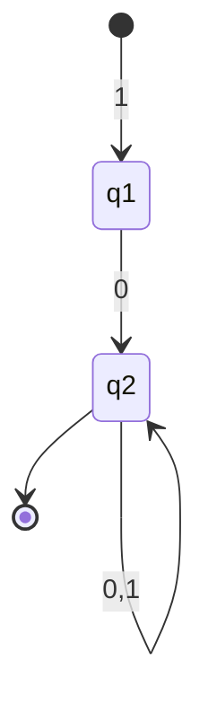
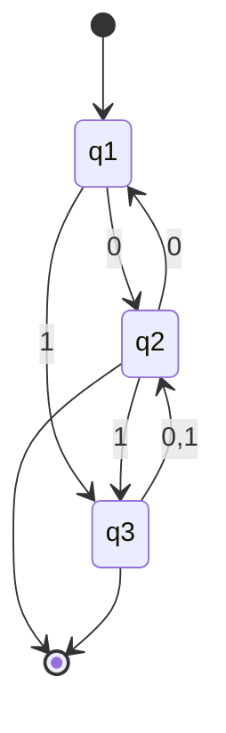

将如图DFA转换为正则表达式。

$$
\begin{aligned}
计算&R_{ij}^{(k)}\\
k&=0\\
R_{11}^{(0)}&=\epsilon+1\\
R_{12}^{(0)}&=0\\
R_{21}^{(0)}&=\empty\\
R_{22}^{(0)}&=\epsilon+0+1\\
\end{aligned}
$$

$$
\begin{aligned}
计算&R_{ij}^{(1)}=R_{ij}^{(0)}+R_{i1}^{(0)}(R_{11}^{(0)})^*R_{1j}^{(0)}\\
k&=1\\
R_{11}^{(1)}&=(\epsilon+1)+(\epsilon+1)(\epsilon+1)^*(\epsilon+1)\\
R_{12}^{(1)}&=0+(\epsilon+1)(\epsilon+1)^*0\\
R_{21}^{(1)}&=\empty+\empty(\epsilon+1)^*(\epsilon+1)\\
R_{22}^{(1)}&=\epsilon+0+1+\empty(\epsilon+1)^*0\\
\end{aligned}
$$

$$
基本化简规则\\
如果r和s是两个正则表达式\\
\begin{aligned}
(\epsilon+r)^*&=r^*\\
(\epsilon+r)r^*&=r^*\\
r+rs^*&=rs^*\\
\empty r=r\empty&=\empty (零元)\\
\empty+r=r+\empty&=r (单位元)\\
\end{aligned}
$$

$$
化简得：\\
\begin{aligned}
R_{11}^{(1)}&=1^*\\
R_{12}^{(1)}&=1^*0\\
R_{21}^{(1)}&=\empty\\
R_{22}^{(1)}&=\epsilon+0+1\\
\end{aligned}
$$

$$
\begin{aligned}
计算&R_{ij}^{(2)}=R_{ij}^{(1)}+R_{i2}^{(1)}(R_{22}^{(1)})^*R_{2j}^{(1)}\\
k&=2\\
R_{11}^{(1)}&=1^*+1^*0(\epsilon+0+1)^*\empty\\
R_{12}^{(1)}&=1^*0+1^*0(\epsilon+0+1)(\epsilon+0+1)^*\empty\\
R_{21}^{(1)}&=\empty+(\epsilon+0+1)(\epsilon+0+1)^*\empty\\
R_{22}^{(1)}&=\epsilon+0+1+(\epsilon+0+1)(\epsilon+0+1)^*(\epsilon+0+1)\\
\\
化简：&\\
R_{11}^{(1)}&=1^*\\
R_{12}^{(1)}&=1^*0(0+1)^*\\
R_{21}^{(1)}&=\empty\\
R_{22}^{(1)}&=(0+1)^*\\

因为&只有q_{2}是接受状态，所以该DFA正则表达式为：\\
R_{12}^{(2)}&=1^*0(0+1)^*\\
\end{aligned}

\\
$$

将如图DFA转换为正则表达式。

$$
\begin{aligned}
k&=0\\
R_{11}^{(k)}&=\epsilon\\
R_{12}^{(k)}&=0\\
R_{13}^{(k)}&=1\\
R_{21}^{(k)}&=0\\
R_{22}^{(k)}&=\epsilon\\
R_{23}^{(k)}&=1\\
R_{31}^{(k)}&=\empty\\
R_{32}^{(k)}&=0+1\\
R_{33}^{(k)}&=\epsilon\\
\end{aligned}
$$

$$
\begin{aligned}
k&=1\\
R_{11}^{(k)}&=\epsilon\\
R_{12}^{(k)}&=0\\
R_{13}^{(k)}&=1\\
R_{21}^{(k)}&=0\\
R_{22}^{(k)}&=\epsilon+00\\
R_{23}^{(k)}&=1+01\\
R_{31}^{(k)}&=\empty\\
R_{32}^{(k)}&=0+1\\
R_{33}^{(k)}&=\epsilon\\
\end{aligned}
$$

$$
\begin{aligned}
k&=2\\
R_{11}^{(k)}&=(00)^*\\
R_{12}^{(k)}&=0(00)^*\\
R_{13}^{(k)}&=0^*1\\
R_{21}^{(k)}&=0(00)^*\\
R_{22}^{(k)}&=(00)^*\\
R_{23}^{(k)}&=0^*1\\
R_{31}^{(k)}&=(0+1)(00)^*0\\
R_{32}^{(k)}&=(0+1)(00)^*\\
R_{33}^{(k)}&=\epsilon+(0+1)0^*1\\
\end{aligned}
$$

$$
k=3，仅状态2和3是接受状态\\
\begin{aligned}
R_{12}^{(3)}&=R_{12}^{(2)}+R_{13}^{(2)}(R_{33}^{(2)})^*R_{32}^{(2)}\\
&=0(00)^*+0^*1(\epsilon+(0+1)0^*1)^*(0+1)(00)^*\\
&=0(00)^*+0^*1((0+1)0^*1)^*(0+1)(00)^*\\
\end{aligned}
\\
\\
\begin{aligned}
R_{13}^{(3)}&=R_{13}^{(2)}+R_{13}^{(2)}(R_{33}^{(2)})^*R_{33}^{(2)}\\
&=0^*1+0^*1(\epsilon+(0+1)0^*1)^*(\epsilon+(0+1)0^*1)\\
&=0^*1((0+1)0^*1)^*\\
\end{aligned}
\\
\therefore R_{12}^{(3)}+R_{13}^{(3)}=0^*1((0+1)0^*1)^*(\epsilon+(0+1)(00)^*)+0(00)^*.\\
$$
