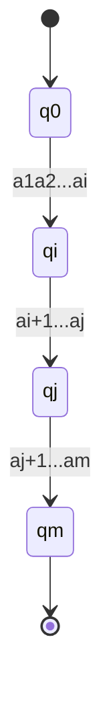
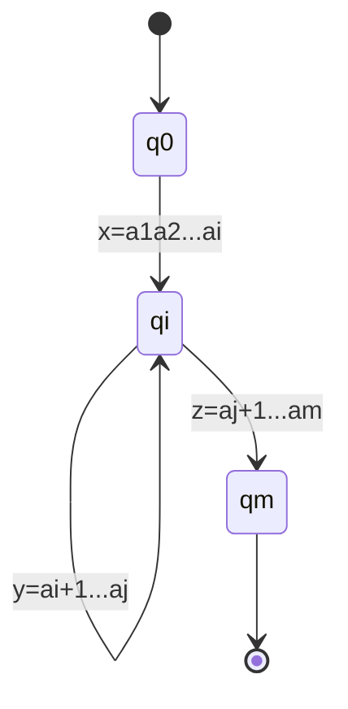

## 泵引理

### 正则语言的泵引理

#### 例题1.

$$
\begin{flalign}
&L=\{0^m1^n|m,n\ge0\}是否是正则语言?\\
&L=0^*1^*是正则语言
\end{flalign}
$$
#### 例题2.

$$
\begin{flalign}
&L=\{0^m1^n|m\ge0,n\ge4\}是否是正则语言?\\
&L=000^*11111^*是正则语言
\end{flalign}
$$
#### 例题3.

$$
\begin{flalign}
&L_{01}=\{0^n1^n|n\ge0\}是否是正则语言?\\
&不是正则语言，但是如何形式化的证明呢?\\
\end{flalign}
$$

### 定律 (正则语言的泵引理)：

$$
\begin{flalign}
如果语言L&是正则的，那么存在正整数N，对\forall w\in L，只要|w|\ge N，就可以将w分为w=xyz满足：\\
1. &y\not=\epsilon(|y|>0);\\
2. &|xy|\le N;\\
3. &\forall \ge0,xy^kz\in L.\\
\end{flalign}
$$

### 证明：

$$
1. &如果L是正则的，那么存在有n个状态的有限状态自动机A使L(A)=L;\\
2. &取w=a_1…a_m\in L(m\ge n)，定义q_i=\hat{\delta(q_0,a1…a_i)};\\
$$

$$
3. &由鸽巢原理，必有两状态相同q_i=q_j & (0\le i<j\le n);\\
4. &那么w=xyz如图，且有\forall k>0, & xy^kz\in L;
$$

$$
5. 而因为i<j，所以y\not =\epsilon (即|y|>0)；因为j\le n，所以|xy|\le n.
$$

## 泵引理的应用

#### 续例3.

$$
\begin{flalign}
&证明L_{01}=\{0^n1^n|n\ge0\}不是正则语言.\\
&\\
&证明：\\
&1. 假设L_{01}是正则的.\\
&2. 那么，存在N\in Z^+，对\forall w\in L_{01}(|w|\ge N)满足泵引理.\\
&3. 从L_{01}中取w=0^N1^N，显然w\in L_{01}且|w|=2N\ge N.\\
&4. 那么，w可被分为w=xyz，且|xy|\le N和y\not = \epsilon.\\
&5. 因此y只能是0^m且m>0.\\
&6. 那么xy^2z=0^{N+m}1^N\not\in L_{01}，而由泵引理xy^2z\in L_{01}，矛盾.\\
&7. 所以假设不成立，L_{01}不是正则的.\\
\end{flalign}
$$

#### 例题4 and 思考题.

$$
\begin{flalign}
&证明L_{eq}=\{w|w由数量相同的0和1构成\}不是正则的.\\
&\\
&思考题：\\
&刚刚已经证明了L_{01}=\{0^n1^n|n\ge0\}不是正则语言\\
&那么，能否使用L_{01}\subseteq L_{eq}来说明L_{eq}也不是正则的呢?\\
&\\
&不行!\\
&反例：\\
&L_{01}\subseteq\Sigma^*=(0+1)^*，而(0+1)^*显然是正则的\\
&\\
&\\
&证明：\\
&1. 假设L_{eq}是正则的.\\
&2. 那么，存在N\in Z^+，对\forall w\in L_{eq}(|w|\ge N)满足泵引理.\\
&3. 从L_{eq}中取w=0^N1^N，显然w\in L_{eq}且|w|=2N\ge N.\\
&4. 那么，w可被分为w=xyz，且|xy|\le N和y\not = \epsilon.\\
&5. 因此y只能是0^m且m>0.\\
&6. 那么xy^2z=0^{N+m}1^N\not\in L_{eq}，而由泵引理xy^2z\in L_{eq}，矛盾.\\
&7. 所以假设不成立，L_{eq}不是正则的.\\
\end{flalign}
$$

#### 心得

**不能用子集不符合泵引理否定集合非正则，只能用集合的子元素不符合泵引理否定集合正则。**

#### 例题5.

$$
\begin{flalign}
&证明L=\{0^i1^j|i>j\}不是正则的.\\
&\\
&证明：\\
&1. 假设L是正则的.\\
&2. 那么，存在N\in Z^+，对\forall w\in L(|w|\ge N)满足泵引理.\\
&3. 从L中取w=0^{N+1}1^N，显然w\in L且|w|=2N+1\ge N.\\
&4. 那么，w可被分为w=xyz，且|xy|\le N和y\not = \epsilon.\\
&5. 因此y只能是0^m且m>0.\\
&6. 那么，xz=xy^0z=0^{N+1-m}1^N\not\in L，因为N+1-m\le N，而由泵引理xy^0z\in L，矛盾.\\
&7. 所以假设不成立，L不是正则的.\\
\end{flalign}
$$

#### 例题6.

$$
\begin{flalign}
\text{Prove }&L=\{a^3b^nc^{n-3}|n\ge 3\}\text{ is not regular.}\\
&\\
证明：&\\
1. &假设L是正则的.\\
2. &那么，存在N\in Z^+，对\forall w\in L(|w|\ge N)满足泵引理.\\
3. &从L中取w=a^3b^Nc^{N-3}，则w\in L且|w|=2N>N.\\
4. &那么，w可被分为w=xyz，且|xy|\le N和y\not = \epsilon.\\
5. &那么，则y只可能有3种情况 (m>0，r>0，s>0)：\\
&1. y=a^m，则xy^2z=a^{3+m}b^Nc^{N-3}\not\in L;\\
&2. y=b^m，则xy^2z=a^3b^{N+m}c^{N-3}\not\in L;\\
&3. y=a^rb^s，则xy^2z=a^3b^sa^rb^Nc^{N-3}\not\in L.\\
6. &无论y为何种情况，xy^2z都不可能在L中，与泵引理矛盾.\\
7. &所以假设不成立，L不是正则的.\\
\end{flalign}
$$

#### 思考题

$$
\begin{flalign}
\bullet &L=\{0^n1^n|0\le n\le 100\}是否是正则语言?\\
\bullet &有限的语言，是否符合泵引理呢?\\
&\bullet \empty\\
&\bullet\{\epsilon\}\\
&\bullet\{0,00\}\\
\end{flalign}
$$

## 泵引理只是必要条件

- 泵引理只是正则语言的**必要条件**

- 只能用来证明某个语言不是正则的
- 与正则语言等价的定理——Myhill-Nerode Theorem

#### 例题7.

$$
\begin{flalign}
语言L&不是正则的，但每个串都可以应用泵引理\\
&L=\{ca^nb^n|n\ge1\}\cup\{c^kw|k\not=1,w\in\{a,b\}^*\}\\
\bullet&其中A=\{ca^nb^n|n\ge1\}部分不是正则得\\
\bullet&而B=\{c^kw|k\not=1,w\in\{a,b\}^*\}部分是正则的\\
\bullet&而A的任何串w=ca^ib^i，都可以应用泵引理，因为w=(\epsilon)(c)(a^ib^i)\\
&重复字符c生成的新串都会落入B中\\
\end{flalign}
$$

#### 思考题

$$
\begin{flalign}
1. &泵引理中的正整数N与DFA的状态数n之间有何关系?\\
2. &与NFA的状态数之间呢？\\
3. &语言L=\{0^nx1^n|n\ge1,x\in\{0,1\}^*\}是否是正则语言?\\
\end{flalign}
$$
