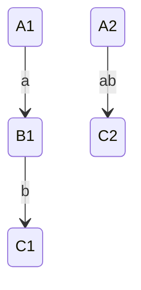
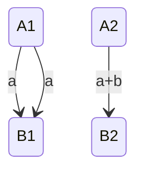
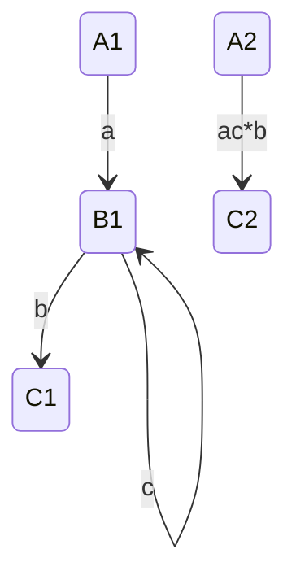
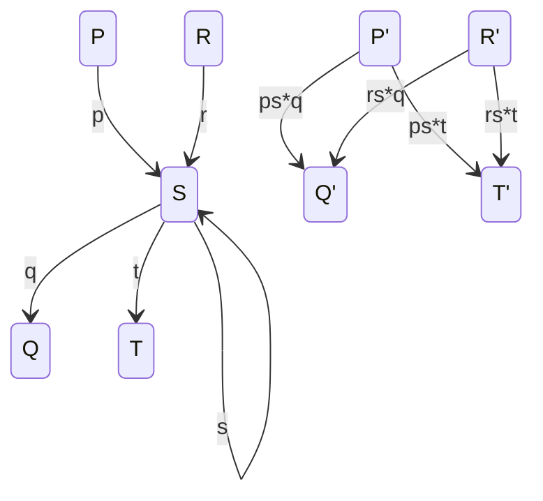
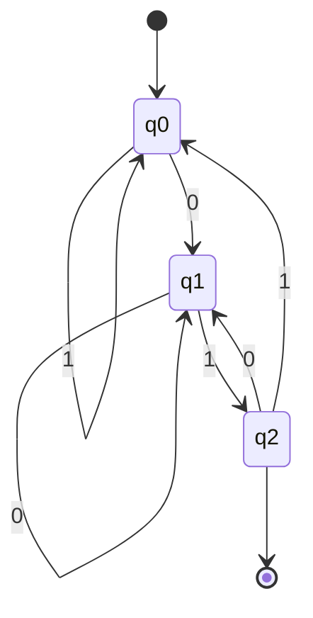
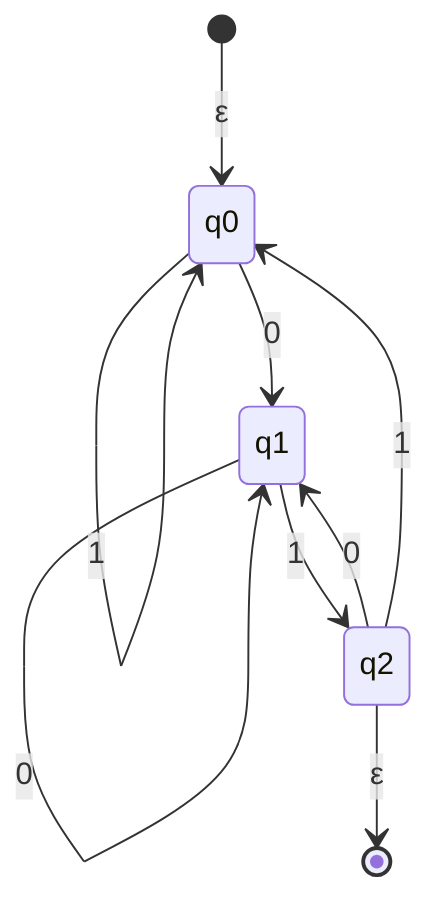
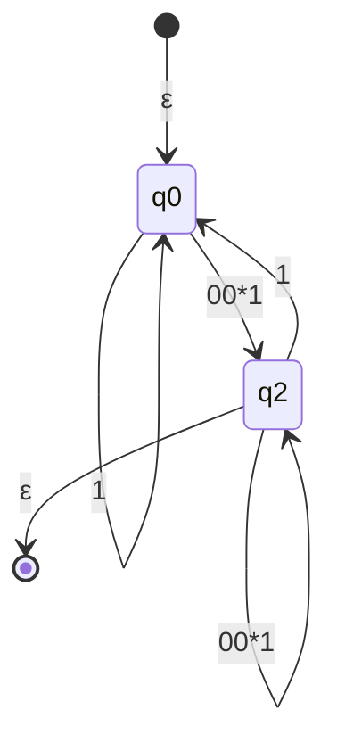
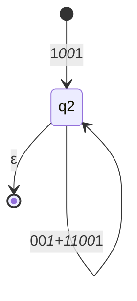
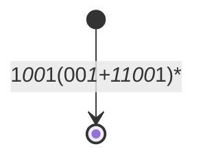
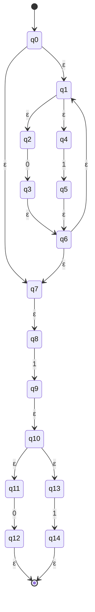

#### 由DFA到正则表达式，状态消除法

- 从DFA中逐个删除状态
- 用标记了正则表达式的新路径替换被删掉的路径
- 保持"自动机"等价

利用状态消除法，构造下图自动机的正则表达式.

添加起始和结束的空转移：

消除状态q1，添加路径q0→q2和q2→q2：

消除状态q0，添加路径s→q2和q2→q2：

消除状态q2，添加路径s→f：

正则表达式(0+1)*1(0+1)构造ε-NFA.

**任何一个DFA存在一个正则表达式，任何一个正则表达式存在一个DFA。**

#### 由正则表达式构造ε-NFA

任何正则表达式e，都存在与其等价的ε-NFA A，即L(A)=L(e)，并且A满足：

1. 仅有一个接受状态；
2. 没有进入开始状态的边；
3. 没有离开接受状态的边。

**正则表达式定义的语言，都可以被又穷自动机识别。**

归纳法可以证明，略。